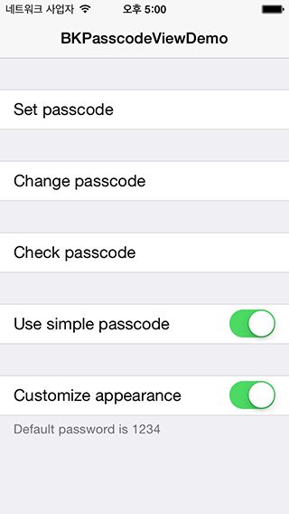
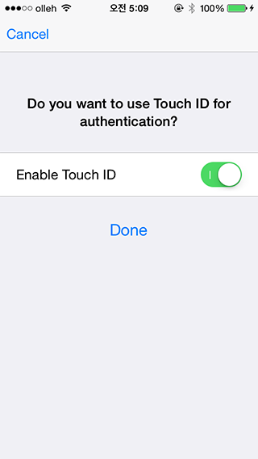
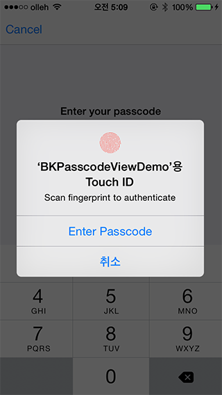
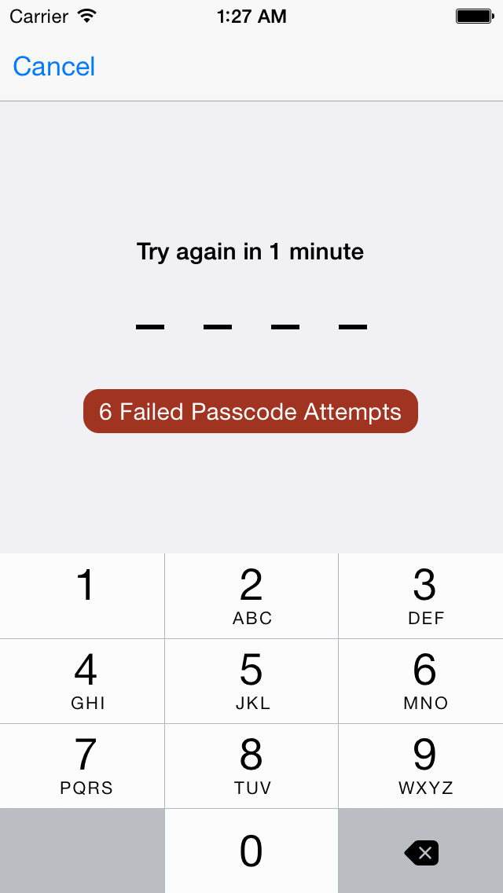
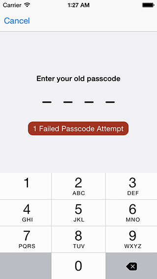
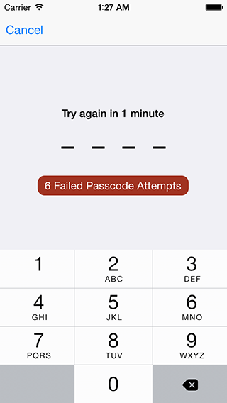
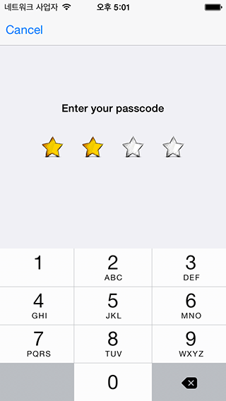

BKPasscodeView
==============
- iOS7 style passcode view. Supports create, change and authenticate password.
- Customizable lock policy for too many failure attempts.
- Customizable passcode digit appearance.
- Shows lock scrren when application entered background state. Use ```BKPasscodeLockScreenManager```
- You can authenticate passcode asynchronously. (e.g. using API to authenticate passcode)
- Supports Touch ID API in iOS 8.

## Screenshots









## Classes
| Class | Description |
| ----- | ----------- |
| ```BKPasscodeField``` | A custom control that conforms ```UIKeyInput```. When it become first responder keyboard will be displayed to input passcode. |
| ```BKPasscodeInputView``` | A view that supports numeric or normal(ASCII) passcode. This view can display title, message and error message. You can customize label appearances by overriding static methods. |
| ```BKShiftingPasscodeInputView``` | A view that make a transition between two ```BKPasscodeInputView```. You can shift passcode views forward and backward. |
| ```BKPasscodeViewController``` | A view controller that supports create, change and authenticate passcode. |
| ```BKPasscodeLockScreenManager``` | A manager that shows lock screen when application entered background state. You can activate with ```activateWithDelegate:``` method. |
| ```BKTouchIDManager``` | A manager that save, load and delete keychain item. It saves passcode to keychain and item cannot be accessed without fingerprint. |

## Podfile
```ruby
platform :ios
pod 'BKPasscodeView', '~> 0.1.2'
```

## Example

### Presenting Passcode View Controller
```objc
BKPasscodeViewController *viewController = [[BKPasscodeViewController alloc] initWithNibName:nil bundle:nil];
viewController.delegate = self;
viewController.type = BKPasscodeViewControllerNewPasscodeType;
// viewController.type = BKPasscodeViewControllerChangePasscodeType;    // for change
// viewController.type = BKPasscodeViewControllerCheckPasscodeType;   // for authentication

viewController.passcodeStyle = BKPasscodeInputViewNumericPasscodeStyle;
// viewController.passcodeStyle = BKPasscodeInputViewNormalPasscodeStyle;    // for ASCII style passcode.

// To supports Touch ID feature, set BKTouchIDManager instance to view controller.
// It only supports iOS 8 or greater.
viewController.touchIDManager = [[BKTouchIDManager alloc] initWithKeychainServiceName:@"<# your keychain service name #>"];
viewController.touchIDManager.promptText = @"Scan fingerprint to authenticate";   // You can set prompt text.

UINavigationController *navController = [[UINavigationController alloc] initWithRootViewController:viewController];
[self presentViewController:navController animated:YES completion:nil];

```

### Show Lock Screen
```objc
- (BOOL)application:(UIApplication *)application didFinishLaunchingWithOptions:(NSDictionary *)launchOptions
{
  // ...
  
  [[BKPasscodeLockScreenManager sharedManager] setDelegate:self];
  
  // ...
  return YES;
}

- (void)applicationDidEnterBackground:(UIApplication *)application
{
  // ...
  // show passcode view controller when enter background. Screen will be obscured from here.
  [[BKPasscodeLockScreenManager sharedManager] showLockScreen:NO];
}

- (BOOL)lockScreenManagerShouldShowLockScreen:(BKPasscodeLockScreenManager *)aManager
{
  return YES;   // return NO if you don't want to present lock screen.
}

- (UIViewController *)lockScreenManagerPasscodeViewController:(BKPasscodeLockScreenManager *)aManager
{
  BKPasscodeViewController *viewController = [[BKPasscodeViewController alloc] initWithNibName:nil bundle:nil];
  viewController.type = BKPasscodeViewControllerCheckPasscodeType;
  viewController.delegate = <# set delegate to authenticate passcode #>;
  
  UINavigationController *navController = [[UINavigationController alloc] initWithRootViewController:viewController];
  return navController;
}
```

